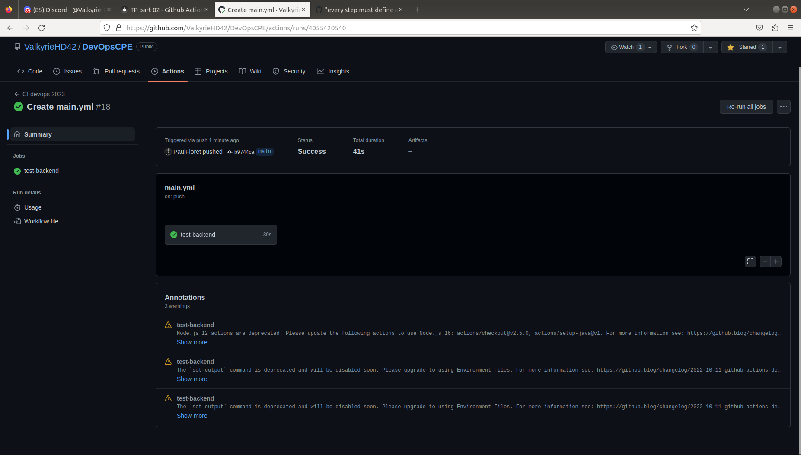

# TP2: GitHub Action and SonarCloud

The first step was to prepare a .yml file to describe the actions to perform when you push code to github.  
We first tried a simple clean previous build then build the new one with :  
` mvn clean verify -X --file ./java-app/simpleapi/`  
The `-X` allows to run the build in debug mode.

Result:  

## 2-1 What are testcontainers?
Library allowing to test components like databases more simply and quickly using doker during java tests

## CI Creation

We added a new section to login into docker hub :
```
  - name: Log in to Docker Hub
    uses: docker/login-action@v1
    with:
      username: ${{ secrets.DOCKERHUB_USERNAME }}
      password: ${{ secrets.DOCKERHUB_TOKEN }}
```
**secrets.DOCKERHUB_USERNAME** and **secrets.DOCKERHUB_TOKEN** are secrets stored in github, theses are the credentials for github to access to our docker hub repository

Dockerhub images :


taks to build images and push them :
```
      - name: Build image and push backend
        uses: docker/build-push-action@v3
        with:
          # relative path to the place where source code with Dockerfile is located
          context: ./simple-api-student-main
          # Note: tags has to be all lower-case
          tags:  ${{secrets.DOCKERHUB_USERNAME}}/simple-api
          push: ${{ github.ref == 'refs/heads/main' }}

      - name: Build image and push database
        uses: docker/build-push-action@v3
        with:
          # relative path to the place where source code with Dockerfile is located
          context: ./postgres
          # Note: tags has to be all lower-case
          tags:  ${{secrets.DOCKERHUB_USERNAME}}/database
          push: ${{ github.ref == 'refs/heads/main' }}
      - name: Build image and push httpd
        uses: docker/build-push-action@v3
        with:
          # relative path to the place where source code with Dockerfile is located
          context: ./apache-server
          # Note: tags has to be all lower-case
          tags:  ${{secrets.DOCKERHUB_USERNAME}}/httpd
          push: ${{ github.ref == 'refs/heads/main' }}
```
the arg  *push* is here to push the built images.

## For what purpose do we need to push docker images?
It is important to have our docker images pushed because we need them when we want to deploy them from an other tool or directly from docker.

## Result

passed pipeline :  


# Setup Quality Gate

Then we tried to create a quality gate using SonarCloud.  
This allows to ensure that we push only clean code and ease the learning and using of best practice.

We first created an organization in SonarCloud.
We linked Martin's github's in order to test this deposit.
Once we added secrets and keys, we were able to link our SonarCloud tests to our deposit changing the build and test step of our .yml to :  
`run: mvn -B verify sonar:sonar -Dsonar.projectKey=ValkyrieHD42_DevOpsCPE -Dsonar.organization=valkyriehd42 -Dsonar.host.url=https://sonarcloud.io -Dsonar.login=${{ secrets.SONAR_TOKEN }}  --file simple-api-student-main/pom.xml`

sonar analysis result :


